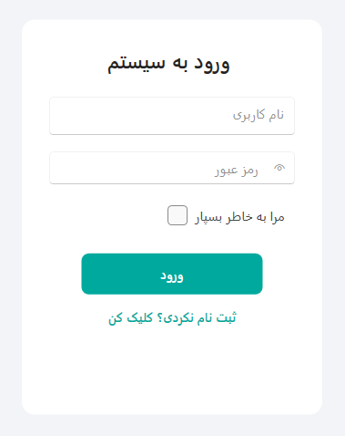
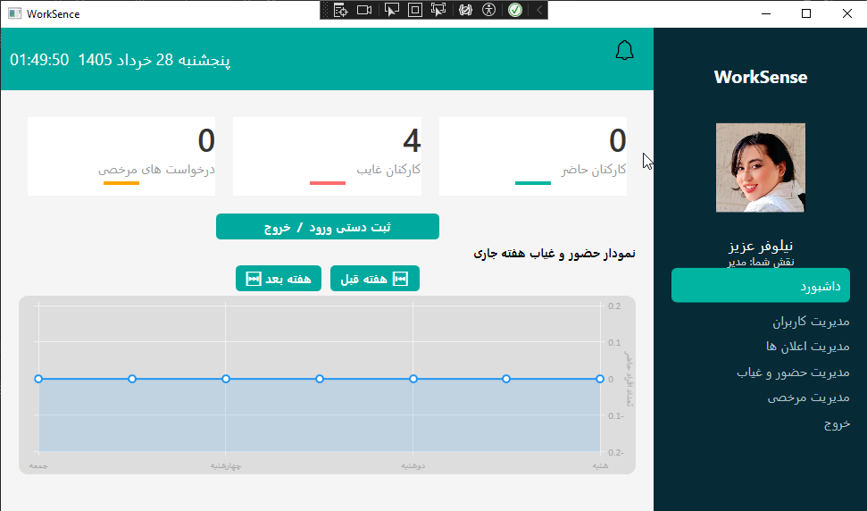
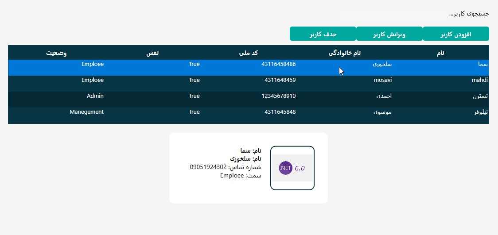
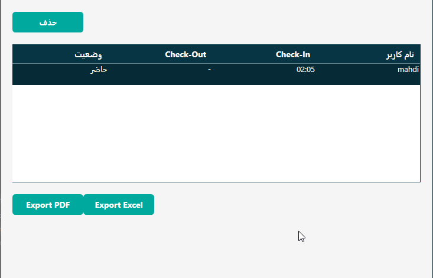
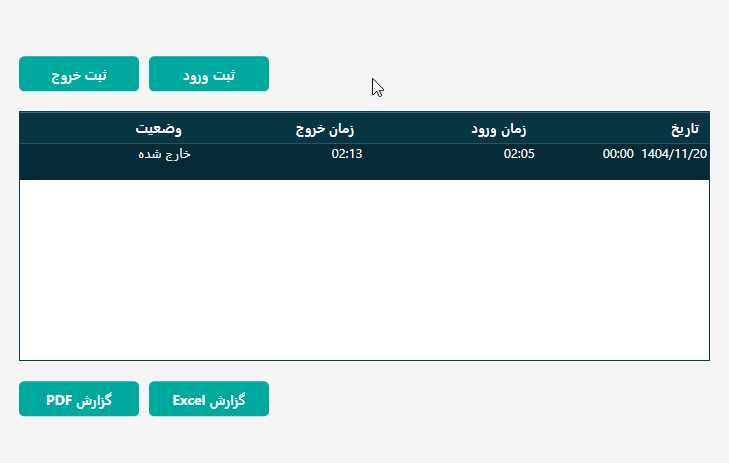
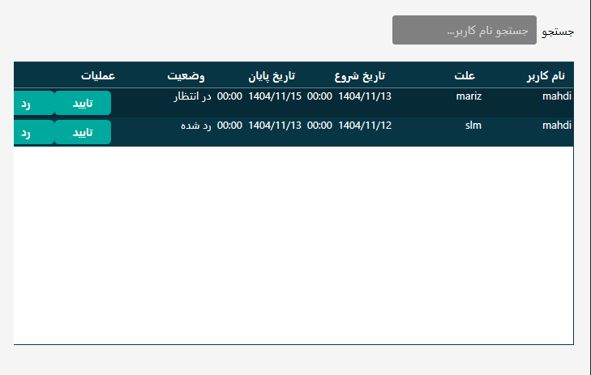

# SmartAttendanceSystem
Employee Attendance and Leave Management System developed using WPF and MVVM architecture.

# Roadmap

v1.0
- Windows Forms
- c#
- Entity Framework

v2.0
- WPF Migration
- MVVM Architecture
- Dashboard
- Leave Management
- Attendance Management
- Reports(PDF/Excel)

v3.0 (Planned)
- ASP.NET Core Web API
- Clean Architecture

# Screenshot
- login
  
- Dashboard
  
- UserManagement
  
- AttendanceManagement
  
  
- LeaveManagement
  
  
- Notification
  
  
  

- JWT Authentication
- Web Admin Panel
